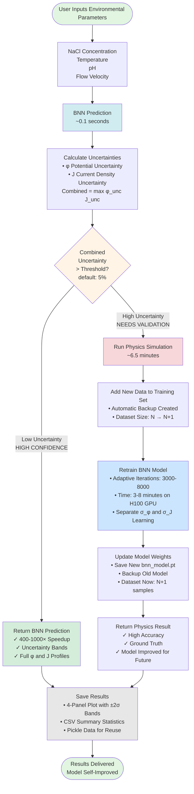

# Active Learning Framework Flowchart

## System Overview for SERDP Pre-Proposal

This flowchart illustrates the intelligent active learning workflow that enables DoD engineers to obtain fast, uncertainty-aware corrosion predictions while automatically improving the model accuracy through strategic physics simulations.



## Key Benefits for DoD Engineers

### 1. **Accessible to Non-Specialists**
- Simple command-line interface
- No manual decision-making about when to use physics vs. surrogate
- Automatic model improvement without expert intervention

### 2. **Cost & Time Reduction**
- **First prediction in new region**: ~7 minutes (physics + retrain)
- **Subsequent similar predictions**: ~0.1 seconds (400-1000× speedup)
- **Batch predictions**: Automatic optimization (BNN where confident, physics only where needed)

### 3. **Built-in Validation & Uncertainty Quantification**
- Visual ±2σ confidence bands on all predictions
- Separate uncertainty for potential (φ) and current density (J)
- Conservative decision-making (max of uncertainties)
- Physics simulation provides ground truth when uncertainty is high

### 4. **Self-Improving System**
- Dataset grows from 16 → 32+ samples through use
- Model accuracy improves with each physics simulation
- Automatic backup of data and models
- No manual data management required

### 5. **Variable Environment Handling**
- Tested ranges: NaCl (0.1-1.0 M), T (278-313 K), pH (6.0-9.0), Flow (0.1-3.0 m/s)
- Extrapolation safety: Automatically triggers physics for out-of-training-range conditions
- Adaptive learning: Model learns the most challenging regions first

## Usage Example

```bash
# Single prediction with automatic BNN/physics switching
./active_learning.py --model bnn_model.pt --data training_data.pkl \
    --nacl 0.3 --temp 290 --ph 7.0 --flow 2.5

# Output includes:
# - BNN or Physics decision (with uncertainty breakdown)
# - Full φ potential field (2541 points)
# - Current density J profile (60 points)
# - ±2σ uncertainty bands
# - Automatic result saving and model retraining if needed
```

## Architecture Highlights

- **Network**: [128, 256, 128] fully-connected layers
- **Separate Noise Learning**: Independent σ_φ and σ_J parameters
- **Training**: 25k iterations, 66 it/s on H100 GPU
- **Performance**: 0.17% φ uncertainty, 1.95% J uncertainty on training data
- **Materials**: CuNi, HY80, HY100, SS316, I625, Ti (extensible)

---

**For SERDP Pre-Proposal**: This framework addresses the SON objective by providing a methodology that:
1. Is usable by DoD engineers (not just specialists)
2. Significantly reduces testing cost and time
3. Provides quantitative uncertainty for decision-making
4. Automatically validates and improves through strategic physics simulations
5. Handles variable severity environments (marine conditions)
