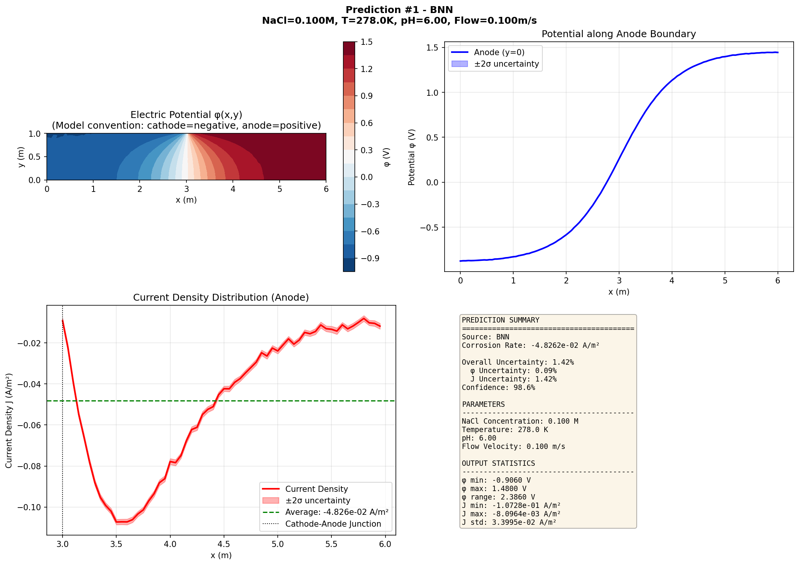
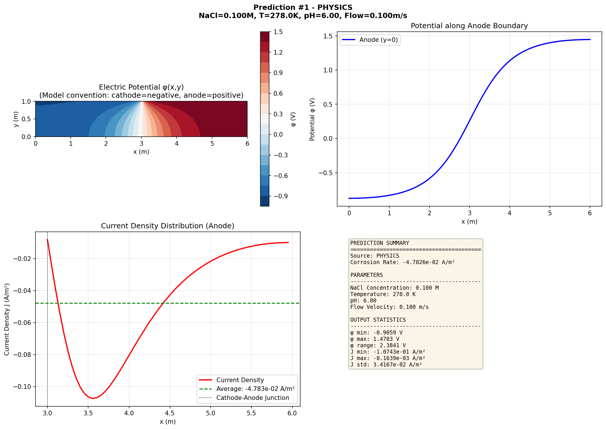
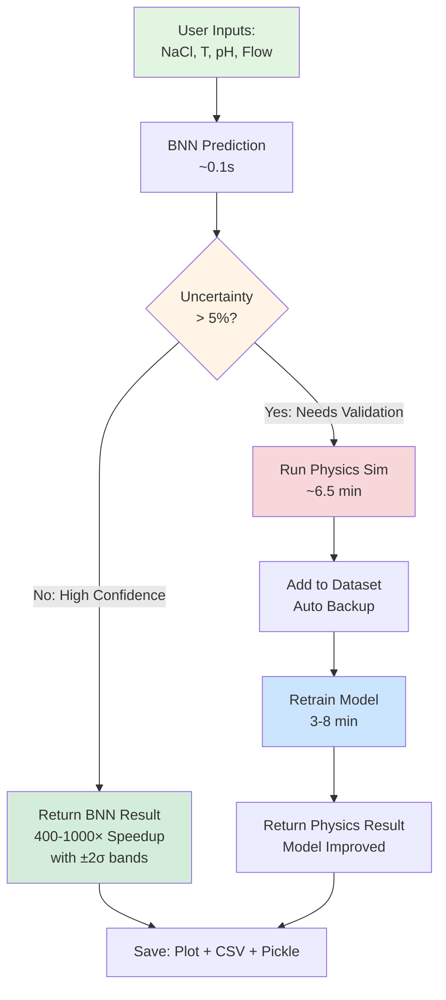
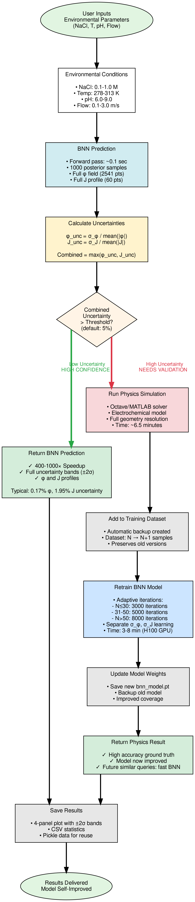

# Bayesian Corrosion Framework

Bayesian Neural Network (BNN) surrogate model for predicting galvanic corrosion in marine environments. Replaces expensive physics simulations with fast, uncertainty-aware predictions.

## Key Features

- **Self-improving active learning**: Model automatically retrains when physics simulations are needed for new parameter regions
- **Uncertainty-aware predictions**: Separate uncertainty quantification for potential (φ) and current density (J) with visual confidence bands
- **Direct prediction** of potential fields (phi) and current density (J) profiles
- **3% average error** for corrosion rate predictions (vs 50% with numerical differentiation)
- **Fast inference**: ~0.1s per prediction with uncertainty quantification
- **GPU accelerated**: 66+ iterations/second on H100 GPU
- **Separate noise learning**: Independent σ_φ and σ_J parameters for optimal uncertainty estimates
- **Material support**: CuNi, HY80, HY100, SS316, I625, Ti

## Current Performance

- **Potential field**: ~0.17% uncertainty on training data
- **Current density**: ~1.95% uncertainty on training data (32 training samples)
- **Training time**: ~6.3 minutes (25k iterations on H100)
- **Network architecture**: [128, 256, 128] with separate noise learning for φ and J
- **Data generation**: ~6.5 minutes per sample
- **Self-improving**: Automatically retrains and grows dataset through active learning

## Example Results with Uncertainty Quantification

The framework provides uncertainty-aware predictions with visual confidence bands:

### High-Confidence BNN Prediction (Training Data Region)
**Parameters**: NaCl=0.10M, T=278K, pH=6.0, Flow=0.10m/s



Key features visible in the plot:
- **Top-left**: Potential (φ) vs position with ±2σ uncertainty band (blue shading)
- **Top-right**: Current density (J) vs position with ±2σ uncertainty band (red shading)
- **Bottom-left**: Statistics comparing BNN vs physics simulation
- **Bottom-right**: Parameter panel showing input conditions

### Physics Simulation Triggered (High Uncertainty Region)
**Parameters**: NaCl=0.10M, T=300K, pH=8.0, Flow=0.01m/s (boundary conditions)



When BNN uncertainty exceeds threshold (default 5%), the system automatically:
1. Falls back to physics simulation for accuracy
2. Adds new data point to training set (with automatic backup)
3. Retrains model on expanded dataset
4. Future predictions in this region use fast BNN

## How It Works: Active Learning Workflow



**Key advantages for engineers:**
- No manual decision-making required
- Automatic validation through physics when uncertain
- Self-improving: 16 → 32+ samples through use
- Accessible to non-specialists (simple command-line interface)
- Cost reduction: 400-1000× speedup for high-confidence regions

### Detailed Workflow Diagram

For a comprehensive view of the active learning system with all components, see the high-resolution flowchart:



This diagram shows:
- Input parameter ranges and validation
- BNN forward pass with 1000 posterior samples
- Separate uncertainty calculation for φ and J
- Decision logic and branching paths
- Adaptive retraining schedule (3000-8000 iterations)
- Automatic backup and model versioning
- Complete timing information for each step

See [ACTIVE_LEARNING_FLOWCHART.md](ACTIVE_LEARNING_FLOWCHART.md) for workflow documentation and [generate_flowchart.py](generate_flowchart.py) to regenerate diagrams.

## Quick Start

### 1. Generate Training Data
```bash
./generate_training_data.py --samples 50 --output training_data.pkl
```

### 2. Train BNN Model
```bash
./train_bnn_model.py --data training_data.pkl --iterations 10000 --output bnn_model.pt
```

### 3. Run Predictions
```bash
# Single prediction
./run_inference.py --model bnn_model.pt --nacl 0.5 --temp 295 --ph 7.5 --flow 1.5

# Compare with training data
./run_inference.py --model bnn_model.pt --data training_data.pkl --compare
```

### 4. Active Learning (Recommended)
Intelligent prediction system that automatically switches between fast BNN predictions and accurate physics simulations based on uncertainty:

```bash
# Single prediction with automatic physics fallback for high uncertainty
./active_learning.py --model bnn_model.pt --data training_data.pkl \
    --nacl 0.3 --temp 290 --ph 7.0 --flow 2.5

# Batch predictions with auto-retraining
./active_learning.py --model bnn_model.pt --data training_data.pkl \
    --params batch_conditions.txt --retrain-every 10

# Custom uncertainty threshold (default: 5%)
./active_learning.py --model bnn_model.pt --data training_data.pkl \
    --nacl 0.8 --temp 300 --ph 8.5 --flow 1.0 --uncertainty 0.03
```

**Benefits:**
- **Self-improving**: Automatically retrains model when physics simulations are run for previously unseen parameters
- Automatic result saving (pickle, CSV, PNG plots)
- 3-10x speedup for interpolation-heavy workloads
- Physics fallback ensures accuracy for extrapolation
- Full visualization: potential contours, current density, statistics

**How it works:**
1. BNN predicts with uncertainty quantification (separate φ and J uncertainty)
2. High uncertainty (>5% on either φ or J) → Physics simulation runs (~6.5 min)
3. **Model immediately retrains** on new data (~3-8 min on H100, adaptive based on dataset size)
4. Dataset grows continuously (backups created automatically)
5. Next similar prediction uses fast BNN instead of physics
6. Visual confidence bands (±2σ) show prediction reliability

See [ACTIVE_LEARNING_GUIDE.md](ACTIVE_LEARNING_GUIDE.md) for details.

## Documentation

- **[QUICKSTART.md](QUICKSTART.md)** - Command reference and common tasks
- **[TRAINING_GUIDE.md](TRAINING_GUIDE.md)** - Improving accuracy, multi-material models, scaling strategies
- **[ACTIVE_LEARNING_GUIDE.md](ACTIVE_LEARNING_GUIDE.md)** - Active learning pipeline usage and configuration
- **[TECHNICAL_NOTES.md](TECHNICAL_NOTES.md)** - Architecture details and implementation notes
- **[CURRENT_DENSITY_ERROR_ANALYSIS.md](CURRENT_DENSITY_ERROR_ANALYSIS.md)** - Problem diagnosis and solution

## Project Structure

```
bayesian-corrosion-framework/
├── generate_training_data.py    # Script 1: Generate physics simulation data
├── train_bnn_model.py            # Script 2: Train BNN on data
├── run_inference.py              # Script 3: Make predictions
├── active_learning.py            # Script 4: Intelligent BNN/physics switching
├── merge_datasets.py             # Utility: Combine datasets
├── src/
│   ├── bnn_model.py             # Core Bayesian Neural Network
│   ├── train_bnn.py             # Training logic
│   ├── physics_bridge.py        # Interface to physics simulations
│   ├── physics_wrapper.m        # Octave wrapper for legacy code
│   ├── run_physics.m            # Physics simulation entry point
│   └── compare_predictions.py   # Visualization and validation
├── training_data.pkl            # Generated training dataset
├── bnn_model.pt                 # Trained model weights
├── active_learning_results/     # Auto-saved predictions and plots
└── tests/                       # Unit and integration tests
```

## Requirements

- Python 3.9+
- PyTorch 2.0+
- Pyro (Bayesian framework)
- Octave 8.0+ (for physics simulations)
- CUDA GPU (optional but recommended for training)

Install dependencies:
```bash
pip install -r requirements.txt
```

## Dependencies

Requires the [Corrosion Modeling Applications](https://github.com/nileshsawant/corrosion-modeling-applications) repository (Octave-compatible fork) for physics simulations.

## Training on Different Materials

Current model trained on: **CuNi (Copper-Nickel)** anode with I625 cathode

To train on other materials:
```bash
# HY80 steel
./generate_training_data.py --samples 50 --materials HY80 --output hy80_data.pkl
./train_bnn_model.py --data hy80_data.pkl --output bnn_hy80.pt

# Stainless Steel 316
./generate_training_data.py --samples 50 --materials SS316 --output ss316_data.pkl
./train_bnn_model.py --data ss316_data.pkl --output bnn_ss316.pt
```

See [TRAINING_GUIDE.md](TRAINING_GUIDE.md) for multi-material models.

## Parameter Ranges

| Parameter | Range | Unit |
|-----------|-------|------|
| NaCl      | 0.1 - 1.0 | M (Molarity) |
| Temperature | 278 - 313 | K (5-40°C) |
| pH        | 6.0 - 9.0 | - |
| Flow velocity | 0.1 - 3.0 | m/s |

## Key Innovation: Direct J Prediction

Traditional approach: Train BNN on phi → Calculate J = -κ∇φ
- **Problem**: Numerical differentiation amplifies small errors
- **Result**: 50% error in J despite <1% error in phi

**Our solution**: Train BNN to predict [phi, J] concatenated
- **Result**: 3% error in J, matching phi accuracy
- **Method**: Physics simulations provide both phi field and J profile

## Performance Scaling

| Dataset Size | Data Gen Time | Training Time | Expected J Error |
|--------------|---------------|---------------|------------------|
| 16 samples   | ~100 min      | ~3 min        | ~3%             |
| 50 samples   | ~325 min      | ~5 min        | ~2%             |
| 100 samples  | ~650 min      | ~7 min        | ~1.5%           |
| 200 samples  | ~1300 min     | ~10 min       | <1%             |

*Based on H100 GPU for training, 8 parallel workers for data generation*

## Citation

If you use this code, please cite:
```bibtex
@software{sawant2026bayesian,
  author = {Sawant, Nilesh},
  title = {Bayesian Corrosion Framework: Uncertainty-Aware Active Learning for Galvanic Corrosion Prediction in Marine Environments},
  year = {2026},
  url = {https://github.com/nileshsawant/bayesian-corrosion-framework}
}
```

## License

[License to be determined]

## Acknowledgments

- Based on legacy MATLAB corrosion modeling code (converted to Octave)
- Bayesian framework built with Pyro
- GPU optimization on H100 GPU at [HPC cluster]
